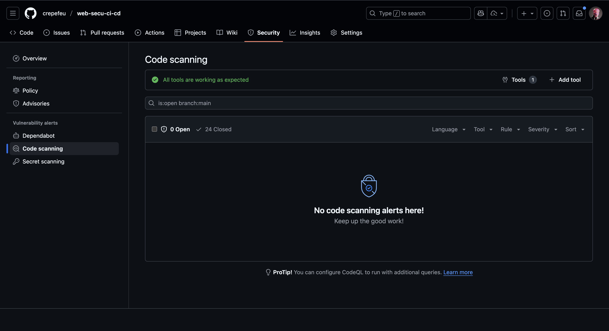

# PART 1 - Assignment Submission

**Group Members:** 
Tessa GERMAIN
Esteban RODRIGUEZ

## Repository and Docker Hub Image Links

- **Public GitHub Repository URL:** https://github.com/crepefeu/web-secu-ci-cd
- **Docker Hub Repository URL:** [0x3st3/vulnerable-web-app:latest](https://hub.docker.com/repository/docker/0x3st3/vulnerable-web-app/general)

## Screenshots




## Code Blocks For The Created Files

### 1. Python Application (`app.py`)
```python
#!/usr/bin/env python3
"""
Vulnerable Web Application for CI/CD Security Testing
This application contains intentional vulnerabilities for educational purposes.
"""

import os
import sqlite3
import subprocess
from flask import Flask, request, render_template_string, send_file

app = Flask(__name__)

# Initialize SQLite database
def init_db():
    conn = sqlite3.connect('users.db')
    cursor = conn.cursor()
    cursor.execute('''
        CREATE TABLE IF NOT EXISTS users (
            id INTEGER PRIMARY KEY,
            username TEXT NOT NULL,
            password TEXT NOT NULL,
            email TEXT
        )
    ''')
    
    # Insert some test data
    cursor.execute("INSERT OR IGNORE INTO users (id, username, password, email) VALUES (1, 'admin', 'password123', 'admin@example.com')")
    cursor.execute("INSERT OR IGNORE INTO users (id, username, password, email) VALUES (2, 'user', 'secret456', 'user@example.com')")
    
    conn.commit()
    conn.close()

@app.route('/')
def home():
    return render_template_string("""
    <h1>Vulnerable Web Application</h1>
    <p>This application contains vulnerabilities for testing purposes.</p>
    <ul>
        <li><a href="/login">SQL Injection Login</a></li>
        <li><a href="/file">Path Traversal File Read</a></li>
        <li><a href="/ping">Command Injection</a></li>
    </ul>
    """)

# Vulnerable SQL Injection endpoint
@app.route('/login', methods=['GET', 'POST'])
def login():
    if request.method == 'POST':
        username = request.form.get('username', '')
        password = request.form.get('password', '')
        
        # VULNERABILITY: SQL Injection
        conn = sqlite3.connect('users.db')
        cursor = conn.cursor()
        query = f"SELECT * FROM users WHERE username='{username}' AND password='{password}'"
        
        try:
            cursor.execute(query)
            user = cursor.fetchone()
            conn.close()
            
            if user:
                return f"Welcome {user[1]}! Your email is: {user[3]}"
            else:
                return "Invalid credentials"
        except Exception as e:
            return f"Database error: {str(e)}"
    
    return render_template_string("""
    <h2>Login</h2>
    <form method="post">
        Username: <input type="text" name="username"><br><br>
        Password: <input type="password" name="password"><br><br>
        <input type="submit" value="Login">
    </form>
    <p>Try: admin' OR '1'='1' --</p>
    """)

# Vulnerable Path Traversal endpoint
@app.route('/file')
def read_file():
    filename = request.args.get('filename', 'README.md')
    
    # VULNERABILITY: Path Traversal
    try:
        file_path = os.path.join('.', filename)
        return send_file(file_path)
    except Exception as e:
        return f"Error reading file: {str(e)}"

# Vulnerable Command Injection endpoint
@app.route('/ping')
def ping():
    host = request.args.get('host', 'localhost')
    
    # Here is the vunlerability (command injection)
    try:
        result = subprocess.check_output(f'ping -c 1 {host}', shell=True, text=True)
        return f"<pre>{result}</pre>"
    except Exception as e:
        return f"Ping failed: {str(e)}"

# Simple math functions for testing
def add_numbers(a, b):
    """Add two numbers together."""
    return a + b

def multiply_numbers(a, b):
    """Multiply two numbers together."""
    return a * b

def divide_numbers(a, b):
    """Divide two numbers."""
    if b == 0:
        raise ValueError("Cannot divide by zero")
    return a / b

if __name__ == '__main__':
    init_db()
    app.run(debug=True, host='0.0.0.0', port=5000)
```

### 2. CI Pipeline (`.github/workflows/ci.yml`)
```yaml
name: CI

on:
  push:
    branches: [ main, master ]
  workflow_dispatch:

permissions:
  contents: read
  security-events: write
  actions: read

jobs:
  test:
    runs-on: ubuntu-latest
    strategy:
      matrix:
        python-version: [3.8, 3.9, "3.10"]

    steps:
    - name: checkout
      uses: actions/checkout@v5

    - name: Python ${{ matrix.python-version }}
      uses: actions/setup-python@v5
      with:
        python-version: ${{ matrix.python-version }}

    - name: dependencies
      run: |
        python -m pip install --upgrade pip
        pip install flake8 pytest
        if [ -f requirements.txt ]; then pip install -r requirements.txt; fi

    - name: flake8
      run: |
        # First run: stop the build if there are Python syntax errors or undefined names
        flake8 . --count --select=E9,F63,F7,F82 --show-source --statistics
        # Second run: exit-zero treats all errors as warnings
        flake8 . --count --exit-zero --statistics

    - name: pytest
      run: |
        pytest tests/

  trivy-scan:
    runs-on: ubuntu-latest
    steps:
    - name: checkout
      uses: actions/checkout@v5

    - name: trivy FS mode
      uses: aquasecurity/trivy-action@0.33.1
      with:
        scan-type: 'fs'
        scan-ref: '.'
        format: 'sarif'
        output: 'results.sarif'
        severity: 'CRITICAL,HIGH'

    - name: upload
      uses: github/codeql-action/upload-sarif@v3
      with:
        sarif_file: 'results.sarif'
```

### 3. CD Pipeline (`.github/workflows/cd.yml`)
```yaml
name: CD

on:
  workflow_run:
    workflows: ["CI"]
    types:
      - completed

jobs:
  build:
    runs-on: ubuntu-latest
    if: ${{ github.event.workflow_run.conclusion == 'success' }}

    steps:
    - name: checkout
      uses: actions/checkout@v5

    - name: login
      uses: docker/login-action@v3
      with:
        username: ${{ secrets.DOCKER_USERNAME }}
        password: ${{ secrets.DOCKER_PASSWORD }}

    - name: build and push
      id: push
      uses: docker/build-push-action@v6
      with:
        context: .
        file: ./Dockerfile
        push: true
        tags: ${{ secrets.DOCKER_USERNAME }}/vulnerable-web-app:latest
```

### 4. Dockerfile
```dockerfile
# Use Python 3.10 slim image as base
FROM python:3.10-slim

# Set working directory
WORKDIR /app

# Copy requirements first to leverage Docker layer caching
COPY requirements.txt .

# Install Python dependencies
RUN pip install --no-cache-dir --upgrade pip && \
    pip install --no-cache-dir -r requirements.txt

# Copy application code
COPY app.py .

# Create a non-root user for security
RUN useradd --create-home --shell /bin/bash appuser && \
    chown -R appuser:appuser /app

# Switch to non-root user
USER appuser

# Expose port 5000
EXPOSE 5000

# Health check
HEALTHCHECK --interval=30s --timeout=10s --start-period=5s --retries=3 \
    CMD curl -f http://localhost:5000/ || exit 1

# Run the application
CMD ["python", "app.py"]
```

### 5. Requirements (`requirements.txt`)
```txt
Flask==2.3.3
Werkzeug==2.3.7
click==8.1.7
itsdangerous==2.1.2
Jinja2==3.1.2
MarkupSafe==2.1.3
```

### 6. Test Suite (`tests/test_app.py`)
```python
import pytest
import sys
import os

sys.path.insert(0, os.path.dirname(os.path.dirname(os.path.abspath(__file__))))

from app import add_numbers, multiply_numbers, divide_numbers, app


class TestMathFunctions:
    """Test cases for mathematical functions in the app."""
    
    def test_add_numbers_positive(self):
        """Test addition with positive numbers."""
        assert add_numbers(2, 3) == 5
        assert add_numbers(10, 15) == 25
    
    def test_add_numbers_negative(self):
        """Test addition with negative numbers."""
        assert add_numbers(-2, -3) == -5
        assert add_numbers(-10, 15) == 5
    
    def test_add_numbers_zero(self):
        """Test addition with zero."""
        assert add_numbers(0, 5) == 5
        assert add_numbers(5, 0) == 5
        assert add_numbers(0, 0) == 0
    
    def test_multiply_numbers_positive(self):
        """Test multiplication with positive numbers."""
        assert multiply_numbers(2, 3) == 6
        assert multiply_numbers(4, 5) == 20
    
    def test_multiply_numbers_negative(self):
        """Test multiplication with negative numbers."""
        assert multiply_numbers(-2, 3) == -6
        assert multiply_numbers(-2, -3) == 6
    
    def test_multiply_numbers_zero(self):
        """Test multiplication with zero."""
        assert multiply_numbers(0, 5) == 0
        assert multiply_numbers(5, 0) == 0
    
    def test_divide_numbers_positive(self):
        """Test division with positive numbers."""
        assert divide_numbers(6, 2) == 3
        assert divide_numbers(15, 3) == 5
    
    def test_divide_numbers_negative(self):
        """Test division with negative numbers."""
        assert divide_numbers(-6, 2) == -3
        assert divide_numbers(-6, -2) == 3
    
    def test_divide_by_zero_raises_error(self):
        """Test that division by zero raises ValueError."""
        with pytest.raises(ValueError, match="Cannot divide by zero"):
            divide_numbers(10, 0)


class TestWebApplication:
    """Test cases for the Flask web application."""
    
    @pytest.fixture
    def client(self):
        """Create a test client for the Flask app."""
        app.config['TESTING'] = True
        with app.test_client() as client:
            yield client
    
    def test_home_page(self, client):
        """Test that the home page loads correctly."""
        response = client.get('/')
        assert response.status_code == 200
        assert b'Vulnerable Web Application' in response.data
        assert b'SQL Injection Login' in response.data
    
    def test_login_page_get(self, client):
        """Test that the login page loads correctly."""
        response = client.get('/login')
        assert response.status_code == 200
        assert b'Login' in response.data
        assert b'Username:' in response.data
    
    def test_file_endpoint_exists(self, client):
        """Test that the file endpoint exists (even though it's vulnerable)."""
        response = client.get('/file')
        assert response.status_code in [200, 404, 500]
    
    def test_ping_endpoint_exists(self, client):
        """Test that the ping endpoint exists."""
        response = client.get('/ping')
        assert response.status_code == 200
```